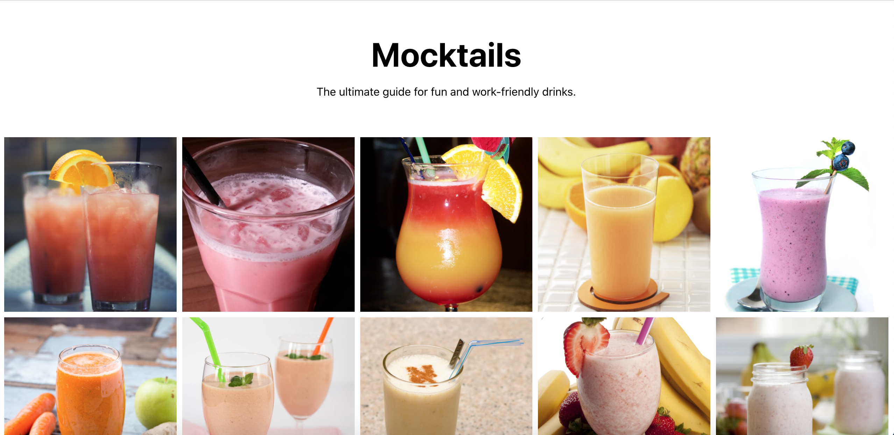

# BioPlus

## Description

React project utilizing material ui v5 for styling. This project displays a list of mocktails in a grid style format to the user. The grid is responsive and resizes when
the browser does. The api is: https://www.thecocktaildb.com/api/json/v1/1/filter.php?a=Non_Alcoholic .

## Installation

First clone the project:

### `git clone https://github.com/simone188535/Bio-Plus.git`

Then, In the project directory, you can run:
### `npm start`

Runs the app in the development mode.\
Open [http://localhost:3000](http://localhost:3000) to view it in your browser.

The page will reload when you make changes.\
You may also see any lint errors in the console.

## Visual
